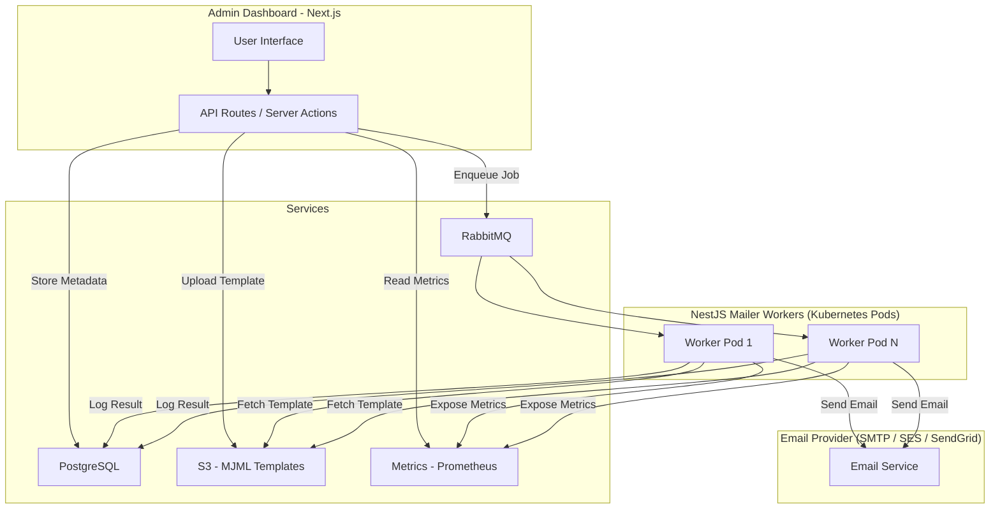

# simplemailer

## Todo
- [ ] MJML rendering
- [ ] S3 capability
- [ ] REST API for triggering mail sending
- [ ] Custom subjects
- [ ] Support for attachments
- [ ] Support for react-mail
- [ ] Prometheus metric for sent mail / min

## Architecture
